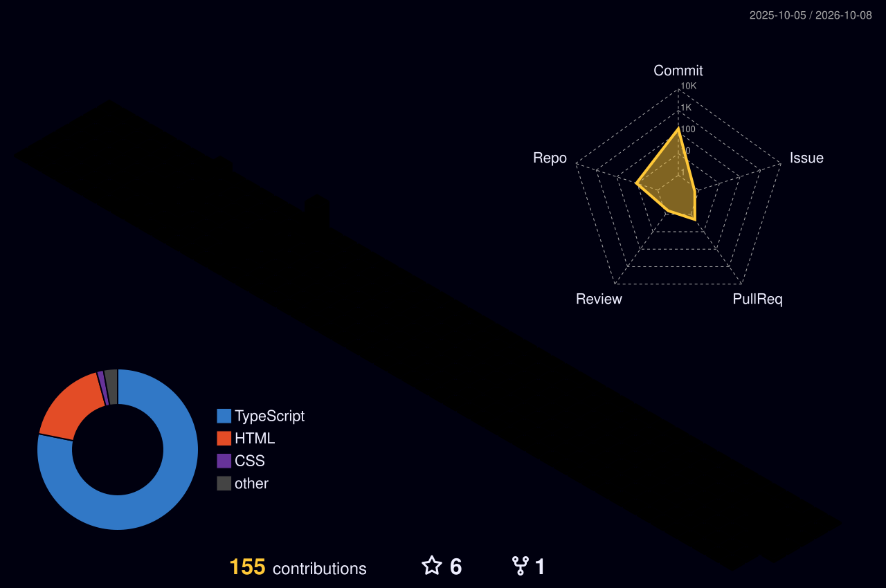

<!-- Header -->
<p align="center">
  
</p>

<p align="center">
  <a href="https://sazzadali-portfolio.vercel.app">
    
  </a>
</p>

<p align="center">
  <a href="https://sazzadali-portfolio.vercel.app"></a>
  <a href="https://www.linkedin.com/in/sazzadali/"></a>
  <a href="https://x.com/Sazzad_Ali_0"></a>
  <a href="https://www.instagram.com/craftcode_studio/"></a>
  <a href="mailto:find.sazzadali@gmail.com"></a>
  
</p>

---

## 👋 About me

```ts
const sazzad = {
  role: "Full-Stack Software Engineer",
  focus: ["Frontend & UI/UX", "Web Design", "AI-powered products"],
  basedIn: "Australia 🇦🇺",
  currentlyBuilding: ["Job Track", "Digital Pragati"],
  loves: ["pixel-perfect UI", "accessible interfaces", "clean TypeScript"],
  openTo: "freelance & full-time roles",
};
```

- 🎨 I design in **Figma** and ship in **Next.js + TypeScript** — from wireframe to production.
- ♿ I care about accessibility, performance and the small details that make an interface feel premium.
- 🤖 Exploring how AI can make everyday products smarter and simpler.
- 📫 Reach me at [find.sazzadali@gmail.com](mailto:find.sazzadali@gmail.com) or on [LinkedIn](https://www.linkedin.com/in/sazzadali/) — always happy to talk design, code or collaboration.

## 🛠️ Tech stack

<p align="center"><b>Frontend</b><br/><br/>
  
</p>

<p align="center"><b>Backend &amp; Data</b><br/><br/>
  
</p>

<p align="center"><b>Tools &amp; Design</b><br/><br/>
  
</p>

## 🚀 Featured projects

<table>
  <tr>
    <td width="50%" valign="top">
      <h3>💼 <a href="https://github.com/ali-sazzad/job-track">Job Track</a></h3>
      <p>Premium job application tracker — CRUD, filters &amp; sorting, insights dashboard, accessible dialogs, skeleton loaders and local persistence.</p>
        
      <br/><br/><a href="https://ali-sazzad.github.io/job-track/"><b>🔗 Live demo →</b></a>
    </td>
    <td width="50%" valign="top">
      <h3>🌏 <a href="https://github.com/ali-sazzad/digital-pragati">Digital Pragati</a></h3>
      <p>Lead-generation websites for Nepali-owned businesses in Australia and Nepal — Next.js site, static site and enquiry backend.</p>
        
      <br/><br/><a href="https://ali-sazzad.github.io/digital-pragati/"><b>🔗 Live demo →</b></a>
    </td>
  </tr>
  <tr>
    <td width="50%" valign="top">
      <h3>🛒 <a href="https://github.com/ali-sazzad/sitebazaar">SiteBazaar</a></h3>
      <p>Colourful website marketplace with bidding and auctions, built on the Next.js App Router.</p>
        
      <br/><br/><a href="https://sitebazaar.vercel.app"><b>🔗 Live demo →</b></a>
    </td>
    <td width="50%" valign="top">
      <h3>🧑‍💻 <a href="https://github.com/ali-sazzad/sazzadali-portfolio">Portfolio</a></h3>
      <p>My personal portfolio as a Frontend &amp; UI/UX Engineer: case studies, projects and contact.</p>
        
      <br/><br/><a href="https://sazzadali-portfolio.vercel.app"><b>🔗 Live demo →</b></a>
    </td>
  </tr>
  <tr>
    <td width="50%" valign="top">
      <h3>✨ <a href="https://github.com/ali-sazzad/brainwave-reactvite">Brainwave</a></h3>
      <p>Modern AI-themed landing page with smooth animations and parallax, built with React and Vite.</p>
        
      <br/><br/><a href="https://brainwave-reactvite.vercel.app"><b>🔗 Live demo →</b></a>
    </td>
    <td width="50%" valign="top">
      <h3>📋 <a href="https://github.com/ali-sazzad/job-application-tracker">Job Application Tracker</a></h3>
      <p>Accessible tracker in semantic HTML, Tailwind and vanilla JS — search, filter, focus-trapped modal and scroll-spy nav.</p>
        
      <br/><br/><a href="https://job-application-tracker-mu-ruby.vercel.app/"><b>🔗 Live demo →</b></a>
    </td>
  </tr>
</table>

## 📊 GitHub activity

<p align="center">
  
</p>

<p align="center">
  
</p>

<p align="center">
  <picture>
    <source media="(prefers-color-scheme: dark)" srcset="https://raw.githubusercontent.com/ali-sazzad/ali-sazzad/output/github-snake-dark.svg" />
    <source media="(prefers-color-scheme: light)" srcset="https://raw.githubusercontent.com/ali-sazzad/ali-sazzad/output/github-snake.svg" />
    
  </picture>
</p>

<!-- Footer -->
<p align="center">
  
</p>
