<!-- Header -->

  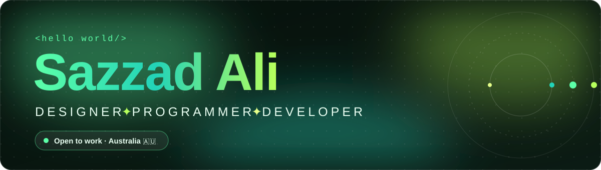

  
  
  
  
  

  
  

  

<!-- About -->

  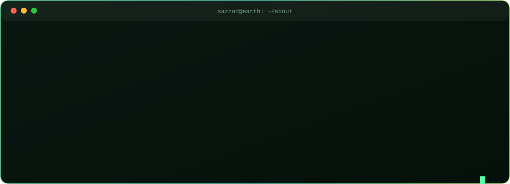

<!-- Projects -->

<table align="center">
  <tr>
    <td width="50%" valign="top">
      <a href="https://github.com/ali-sazzad/job-track"></a> 
      
      
    </td>
    <td width="50%" valign="top">
      <a href="https://github.com/ali-sazzad/digital-pragati"></a> 
      
      
    </td>
  </tr>
  <tr>
    <td width="50%" valign="top">
      <a href="https://github.com/ali-sazzad/sitebazaar"></a> 
      
      
    </td>
    <td width="50%" valign="top">
      <a href="https://github.com/ali-sazzad/sazzadali-portfolio"></a> 
      
      
    </td>
  </tr>
  <tr>
    <td width="50%" valign="top">
      <a href="https://github.com/ali-sazzad/brainwave-reactvite"></a> 
      
      
    </td>
    <td width="50%" valign="top">
      <a href="https://github.com/ali-sazzad/job-application-tracker"></a> 
      
      
    </td>
  </tr>
</table>

<!-- Stack -->

  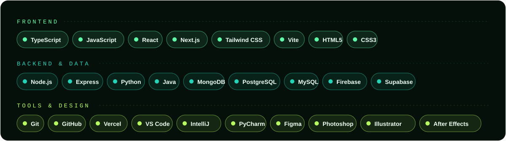

<!-- Activity -->

  

  <picture>
    <source media="(prefers-color-scheme: dark)" srcset="./profile-3d-contrib/profile-night-green.svg" />
    <source media="(prefers-color-scheme: light)" srcset="./profile-3d-contrib/profile-green-animate.svg" />
    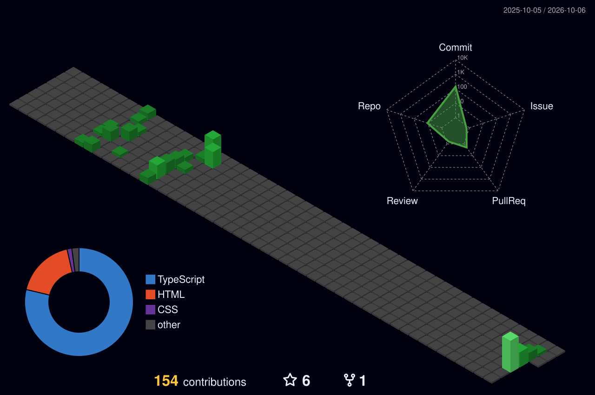
  </picture>

  <picture>
    <source media="(prefers-color-scheme: dark)" srcset="https://raw.githubusercontent.com/ali-sazzad/ali-sazzad/output/github-snake-dark.svg" />
    <source media="(prefers-color-scheme: light)" srcset="https://raw.githubusercontent.com/ali-sazzad/ali-sazzad/output/github-snake.svg" />
    
  </picture>

<!-- Footer -->

  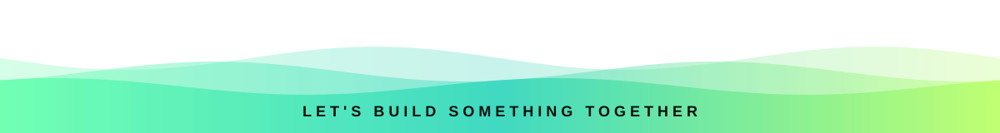

